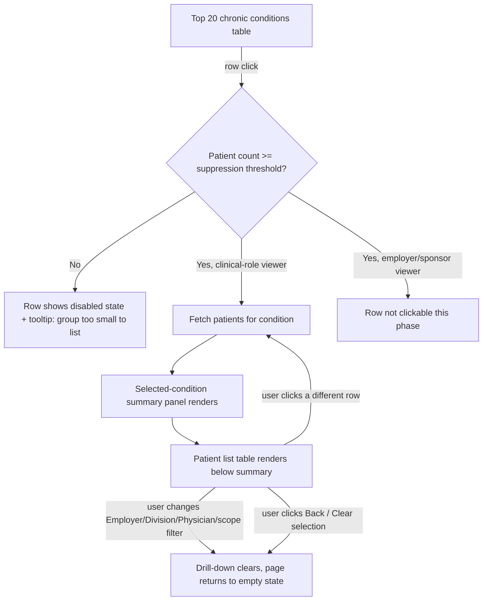

# PRD: Chronic Risk Report — Top Conditions Table & Patient Drill-Down

| | |
|---|---|
| **Status** | Draft v1 |
| **Date** | August 27, 2026 |
| **Page** | Chronic Risk Report (ACME DPC / HealthCompiler) |
| **Author** | Product |
| **Related artifacts** | `Chronic_Risk.pdf` (current-state export), `Chronic_Validation.xlsx` → `icd10_chronic` reference table, interactive redesign prototype (shared in prior design discussion) |

---

## 1. Background

The Chronic Risk report currently renders the practice's chronic condition mix as a horizontal bar chart. Each bar is labeled with a bare ICD-10 code (`I10`, `E78.5`, `E11.9`...); the human-readable description only appears on mouseover.

This breaks in two ways users hit constantly:

1. **Static exports lose the description entirely.** Screenshots and pasted PowerPoint slides capture the bar and the code, not the tooltip. The employer/board audience this report is usually shared with never sees what `E78.5` means.
2. **The chart only shows 5 conditions.** Practices with a broader chronic mix have no way to see conditions 6 through 20+ without leaving the report.

A CSV export exists as a workaround and does contain full descriptions, but it doesn't fix the in-product experience, which is the primary way this report gets consumed and shared.

This PRD covers two changes:

- **Feature A** — replace the 5-bar chart with a Top 20 table that shows full descriptions inline (no hover dependency), with graceful handling for practices that have fewer than 20 distinct chronic conditions.
- **Feature B** (new in this doc) — clicking a condition row drills into the specific patients behind that number: a summary of that patient population renders above a patient list table.

Feature A was prototyped earlier; this PRD formalizes both into implementation-ready requirements.

---

## 2. Goals

| # | Goal |
|---|---|
| G1 | Every chronic condition shown on the page is identifiable from static text alone — no information is hover-only. |
| G2 | The report surfaces up to the top 20 chronic conditions per practice, not just 5, without breaking on practices that have fewer than 20. |
| G3 | A user can go from "this condition is common in my practice" to "here are the specific patients" without leaving the page. |
| G4 | The drill-down respects the report's existing filter context (employer, division, physician, active-patient definition) and does not introduce a new PHI exposure surface beyond what the viewing role already has access to. |

### Non-goals

- Redesigning the filter bar (Employer / Division / Physician) itself.
- Building any write actions (editing a patient's chart, adding a diagnosis) from this page.
- Changing how "Total Active Patients" vs. "Patients with Encounter(s)" is calculated — the drill-down inherits whichever is currently selected.
- Redesigning the Chronic Condition Distribution (comorbidity) chart's logic — only its label rendering is touched, per §7.4.
- Building a de-identified/aggregate-only drill-down for employer-facing viewers. Flagged as a future phase in §11.

---

## 3. User stories

- As a **practice administrator**, I want the top conditions list to show full descriptions as plain text, so I can screenshot it into a board deck without anyone needing to guess what `I37.0` means.
- As a **physician or care coordinator**, I want to click a condition and immediately see which of the practice's patients carry that diagnosis, so I can plan outreach (e.g., an A1c recall campaign for the diabetes row) without exporting a CSV and cross-referencing manually.
- As a **practice admin at a small clinic**, I want the report to make sense when my practice only has 8 distinct chronic conditions on file, not show 12 empty rows or a chart that implies data is missing.
- As an **employer/sponsor viewer**, I want population-level condition prevalence without ever seeing an individually identifiable patient, so the report stays usable for benefits decisions without a compliance review each time.

---

## 4. Current state (as-is)

From the current export:

- **KPI card**: Chronic Condition Patients — count + % of Total Active Patients (e.g., 1,612 / 57.1%, of 2,823 total).
- **Top Chronic Conditions (left panel)**: horizontal bar chart, hardcoded to the top 5 codes by % of active patients. Y-axis label is the bare ICD-10 code; full description is hover-only.
- **Chronic Condition Distribution (right panel)**: 4 fixed buckets — No Comorbidity, Comorbidity, Low Multimorbidity, High Multimorbidity — each as a % of active patients. In the current export these labels render with a trailing underscore (`No Comorbidity_`), which is the same hover-truncation pattern as the left panel, just less obviously broken.
- **Export**: CSV download with full descriptions (unaffected by this PRD).

### What the reference data tells us

The `icd10_chronic` table (`Chronic_Validation.xlsx`) is the description source of truth: **75,007 ICD-10 codes**, each with a `description`, a `chronic_indicator` flag, and (inconsistently) a `short_description`. This confirms the fix is a **rendering problem, not a data-availability problem** — descriptions already exist and are already joined for the CSV export; they just aren't rendered persistently in the chart itself.

Two data quality facts from that table that directly affect this build:

| Finding | Value | Implication |
|---|---|---|
| `chronic_indicator` values in use | `0` (51,794 rows), `1` (12,669 rows), `9` (10,544 rows) | Only `1` should presumably feed this report. **`9` is unexplained — flagged as an open question in §12; needs an engineering/clinical answer before launch.** |
| Rows with `chronic_indicator = 1` and a **null** `description` | 13 rows | The table must have a defined fallback (see §7.3) rather than rendering a blank cell. |

*Assumption flagged for confirmation:* we're assuming the existing aggregate (code → patient count) is computed from a patient-condition mapping that already exists upstream (it has to, to produce the current bar chart's percentages). Feature B's patient list is a new **read path** into that same mapping, not a new computation.

---

## 5. Proposed solution — overview



The page keeps its existing two-panel layout (Top Conditions / Chronic Condition Distribution) and adds a third, initially-empty section below it: **Patient detail**. Clicking a condition row populates that section; it does not touch the Distribution panel, which stays as ambient context regardless of selection.

---

## 6. Feature A — Top 20 chronic conditions table

### 6.1 Functional requirements

| # | Requirement |
|---|---|
| FR-A1 | Replace the bar chart with a table: `Rank`, `ICD-10 Code`, `Condition` (full description), `Share of active patients` (% + inline bar), `Patients` (count). |
| FR-A2 | Show up to 20 rows, ranked by % of active patients, descending. |
| FR-A3 | If a practice has fewer than 20 distinct chronic conditions coded, show all of them — no empty/placeholder rows — and update the section heading to reflect the true count (e.g., "Top 8 chronic conditions" / "Showing all 8 conditions coded — fewer than 20 identified for this practice."). |
| FR-A4 | If a practice has 20 or more, heading reads "Top 20 chronic conditions" with a subheading noting the total distinct count found (e.g., "Showing top 20 of 34 conditions coded across active patients."). |
| FR-A5 | Every description is static text — no hover required to read it. |
| FR-A6 | Existing CSV export is unaffected and continues to reflect whatever scope (top 20 vs. fewer) is on screen. |

### 6.2 Data requirements

- Join the per-code aggregate (code, patient_count, pct_of_active) against `icd10_chronic` on `code`, filtered to `chronic_indicator = 1` (pending resolution of the `9` question in §12).
- Return `total_conditions_found` alongside the top-N slice so the UI can compute the "of 34" / "showing all 8" copy without a second call.

### 6.3 Edge cases

| Case | Behavior |
|---|---|
| Fewer than 20 distinct conditions | Show all, adjust heading (FR-A3). |
| Zero chronic conditions coded for the practice | Show an empty state: "No chronic conditions have been coded for this patient population yet," not an empty table shell. |
| `description` is null (13 known rows today) | Fall back to `short_description`; if that's also null, render the code with a muted "Description not available for this code" instead of a blank cell. Never leave the cell empty. |
| Tie in % between two conditions | Stable secondary sort by patient count, then by code, so row order doesn't shuffle between loads. |

### 6.4 Acceptance criteria

- Given a practice with 34 coded chronic conditions, the table shows exactly 20 rows and the subheading reads "Showing top 20 of 34 conditions coded across active patients."
- Given a practice with 8 coded chronic conditions, the table shows exactly 8 rows, no padding, and the subheading reads "Showing all 8 conditions coded — fewer than 20 identified for this practice."
- Given a row whose `description` is null, the row still renders a readable label and never a blank cell.
- No description in the table requires a hover, click, or tooltip to be read.

---

## 7. Feature B — Click a condition → patient list (new)

### 7.1 Interaction flow

1. Default state: table has no row selected; the Patient detail section below is collapsed/empty with a prompt ("Select a chronic condition above to see the patients behind it.").
2. User clicks anywhere on a condition row (not just an icon — full row is the hit target).
3. If that row's patient count is at or above the suppression threshold **and** the viewer's role permits patient-level detail (§7.5):
   - The row shows a selected state (e.g., left accent bar + tinted background).
   - The Patient detail section populates with, top to bottom:
     a. **Selected-condition summary panel** (§7.2) — this is "the patients in that chronic condition, represented above the table," per the request.
     b. **Patient list table** (§7.3) below it.
   - The page scrolls the Patient detail section into view.
4. If the row's patient count is below the suppression threshold: the row is visibly non-interactive (muted, cursor not a pointer) and a tooltip/inline note explains why (§7.4).
5. If the viewer's role doesn't have patient-level access: rows render as normal but are not clickable this phase (§7.5).
6. Clicking a different eligible row swaps the detail section to the new condition (no need to clear first).
7. Clicking a "Clear selection" affordance in the summary panel, or **changing any top-level filter** (Employer, Division, Physician, or the Total Active/Encountered toggle), clears the selection and returns the Patient detail section to its empty state. This prevents a stale patient list that no longer matches the filters shown elsewhere on the page.

### 7.2 Selected-condition summary panel (sits above the patient list table)

Purpose: represent the patient population for the clicked condition before showing them one by one.

| Field | Notes |
|---|---|
| Condition title | `{code} — {full description}` |
| Patient count + % of active patients | Same numbers as the table row, for consistency. |
| Average age | Computed from the filtered patient set. |
| Gender split | Aggregate only, e.g., "54% female / 46% male." |
| Average total chronic conditions | Mean comorbidity count within this specific patient group — gives context the top-level Distribution chart can't (that chart is population-wide, not condition-specific). |
| Top 3 co-occurring conditions | The other chronic conditions most frequently shared by this patient group, e.g., "Also commonly coded: hyperlipidemia (61%), obesity (38%), GERD (22%)." |
| Clear selection / back control | Returns to empty state (§7.1 step 7). |

All fields here are aggregate — no individual patient is identifiable from this panel alone, which is intentional (see §7.5).

### 7.3 Patient list table

| Column | Notes |
|---|---|
| Patient | Display name, gated by role (§7.5) — restricted roles see a masked identifier instead. |
| Age | |
| Gender | |
| Assigned physician | |
| Division | |
| Condition first coded | Date this specific diagnosis first appears for the patient. |
| Last encounter (any) | |
| Total chronic conditions | This patient's personal comorbidity count — links back to the summary panel's average. |
| Action | "View patient chart" — deep links into the existing patient record page. Not a new capability, just a shortcut. |

Behavior:

- Paginated (25 or 50 per page — see open question in §12), not virtualized-infinite, to keep the export/print story simple.
- Sortable by any column; default sort is `Condition first coded`, most recent first.
- Search/filter box scoped to this list only (by patient name or ID).
- Optional "Export this list" button, itself subject to the same role gating as the table (§7.5) — out of scope to fully spec here, flagged for a follow-up ticket.

### 7.4 Chronic Condition Distribution panel — label fix

Not part of the drill-down interaction, but bundled here since it's the same underlying problem as Feature A: the current export shows truncated labels (`No Comorbidity_`) that depend on a hover to complete. Fix: render the full label and a static subtitle inline, same pattern as the table descriptions — no hover required. Suggested subtitles (**placeholder wording — confirm actual bucket definitions with clinical/product before shipping**):

- No comorbidity — 1 condition
- Comorbidity — 2 conditions
- Low multimorbidity — 3–4 conditions
- High multimorbidity — 5+ conditions

### 7.5 Privacy, compliance & access control — **must-have, not a stretch goal**

This is the section most likely to block launch if skipped, so it's called out on its own rather than folded into "edge cases."

1. **Small-cell suppression.** Several tail conditions in a typical Top 20 list will have very low patient counts (single digits to low teens in the examples we've seen). Listing named patients for a group that small is a re-identification risk even inside a permissioned tool. Proposal: a configurable threshold, **default 11** (the common small-cell suppression cutoff used elsewhere in healthcare reporting), below which the row's drill-down is disabled entirely — the aggregate % and count still show in the table (Feature A is unaffected), but clicking does not produce a patient list.
2. **Role gating.** This report is used by at least two audiences with very different PHI access: internal clinical/practice roles (physician, care coordinator, practice admin) and external employer/sponsor viewers (the "Employer: All Sponsored Patients" filter implies sponsor-facing use). Proposal for this phase:
   - Patient-level drill-down ships **only for clinical/practice-internal roles**, and only for patients already within that user's existing access scope (e.g., a physician sees their own patients, not the whole practice, if that's how permissions work elsewhere in the product — needs confirmation, see §12).
   - Employer/sponsor-role viewers do not get the click interaction at all in this phase. Rows render normally but aren't clickable. A de-identified, aggregate-only version of the drill-down for that audience is a reasonable **future** phase, not this one — see §11.
3. **Audit logging.** Every patient-list view (condition code, viewer, timestamp, filter context) should be logged, consistent with how the product presumably already logs access to individual patient charts elsewhere.
4. **No new field types.** The patient list only surfaces fields the product already exposes elsewhere (patient roster, chart pages) — this feature is a new **filtered view** into existing access, not a new data exposure.

### 7.6 Additional edge cases

| Case | Behavior |
|---|---|
| Condition selected, then an active filter (Employer/Division/Physician/scope toggle) changes | Drill-down clears immediately; do not silently re-fetch and show a mismatched list. |
| Patient count exactly at the suppression threshold | Treat threshold as inclusive of allowed (`>= threshold` is clickable, per §7.5) — confirm exact boundary with legal/compliance. |
| User rapidly clicks multiple rows | Debounce; only the latest click's request should render (cancel/ignore in-flight stale requests). |
| Patient has the condition coded but no encounters in the current scope (e.g., "Patients with Encounter(s)" toggle is active) | Excluded from the list, consistent with how the aggregate count itself is scoped. |
| A patient appears under multiple selected conditions across separate clicks | Expected and fine — each drill-down is independently scoped to one condition. |

### 7.7 Data & API requirements (illustrative — align with actual service conventions)

```
GET /api/v1/chronic-risk/conditions
  params: practice_id, employer_id?, division_id?, physician_id?, patient_scope=active|encountered
  → { total_conditions_found, conditions: [
        { code, description, short_description, patient_count, pct_of_active_patients }
      ] }

GET /api/v1/chronic-risk/conditions/{code}/patients
  params: practice_id, employer_id?, division_id?, physician_id?, patient_scope,
          page, page_size, sort_by, sort_dir, search?
  → {
      code, description,
      summary: {
        patient_count, pct_of_active_patients, avg_age,
        gender_split: { female: 0.54, male: 0.46 },
        avg_total_conditions,
        top_co_occurring: [ { code, description, pct_of_group } ]
      },
      suppressed: false,
      patients: [
        { patient_id, display_name, age, gender, physician, division,
          condition_first_coded, last_encounter, total_chronic_conditions }
      ],
      pagination: { page, page_size, total_patients }
    }
```

When `patient_count < suppression_threshold`, the same endpoint returns `suppressed: true`, `patients: null`, and the `summary` block still populated (aggregate stats are fine to show; the list is what's withheld).

### 7.8 Acceptance criteria

- Clicking an eligible condition row renders the summary panel followed by the patient list, in that order, without navigating away from the page.
- The summary panel's patient count matches the table row's count exactly.
- Clicking a row whose count is below the suppression threshold never renders a patient list, regardless of role.
- Changing any top-level filter while a condition is selected clears the drill-down.
- An employer/sponsor-role viewer cannot trigger the patient list under any interaction in this phase.
- Every patient-list view is captured in the audit log with condition, viewer, and filter context.

---

## 8. Non-functional requirements

- **Performance**: condition aggregate call should remain near-instant (it's the existing computation); patient-list call should be indexed on `(practice_id, condition_code)` at minimum — flag to engineering if that index doesn't already exist, since this is a new query pattern.
- **Accessibility**: condition rows are keyboard-focusable and activate on Enter/Space; selected state is exposed via `aria-selected`; the summary panel is announced to screen readers when it updates.
- **No new browser/device support requirements** beyond what the page already targets.

## 9. Analytics & instrumentation

Track, at minimum: `condition_row_clicked` (code, rank, patient_count, role), `patient_list_viewed`, `drill_down_cleared`, `suppressed_row_click_attempted`. This tells us which conditions get drilled into most, and how often the suppression guardrail is actually hit — useful for tuning the default threshold post-launch.

## 10. Rollout plan

| Phase | Scope |
|---|---|
| 1 | Feature A (Top 20 table). Ships independently — real value on its own, no drill-down dependency. |
| 2 | Feature B, clinical/practice-internal roles only, behind a feature flag. |
| 3 (future, not speced here) | De-identified aggregate-only drill-down for employer/sponsor viewers. |
| 4 (future, not speced here) | Extend CSV/print export to include a selected condition's patient list. |

## 11. Open questions

1. What does `chronic_indicator = 9` mean in the reference table (10,544 codes — not a small number)? Needs a definitive answer before deciding whether those codes are eligible for this report at all.
2. Does a physician role see only their own patients elsewhere in the product? The drill-down should mirror whatever that existing scoping rule is, rather than introduce a new one.
3. Confirm the actual comorbidity bucket definitions (§7.4) — the condition-count subtitles proposed here are placeholders.
4. Confirm the suppression threshold (11 proposed) and whether it should be configurable per practice or fixed platform-wide.
5. Page size for the patient list (25 vs. 50) — no strong opinion, defer to existing table conventions elsewhere in the product if one exists.
6. Is there an existing lower-page component today that this "Patient detail" section should replace or extend, rather than being introduced as new? This PRD assumes a new section since none was visible in the current-state export we reviewed — worth confirming against the live page.

## 12. Appendix — data dictionary (`icd10_chronic`)

| Column | Type | Notes |
|---|---|---|
| `id` | uuid | Internal identifier. |
| `code` | string | ICD-10 code, e.g. `I10`. |
| `description` | string, nullable | Full description; null in 13 known rows among chronic codes. |
| `short_description` | string, mostly null | Fallback candidate when `description` is null; sparsely populated today. |
| `chronic_indicator` | 0 / 1 / 9 | 1 = chronic (drives this report); 0 = not chronic; 9 = undefined, see open question #1. |
| `added_status` | string, nullable | Freeform note on some rows (e.g., "Added while patient problem data load."), not currently used in this report. |
| `created_at` / `updated_at` | timestamp | Reference table maintenance metadata. |
